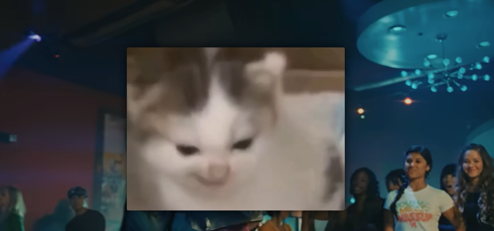
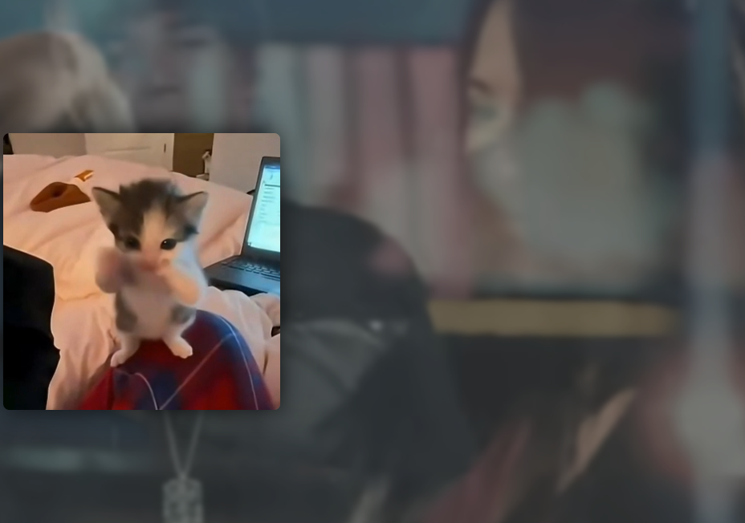

# [Ragebait Player] ▶️

## Basic Details
### Team Name: Sector 45

### Team Members
- Team Lead: Aleesha S Boby - SOE CUSAT
- Member 2: Aishani V Warrier - SOE CUSAT

### Project Description

Ragebait YouTube Player is a Chrome extension that hijacks your own YouTube playback with random volume swings, fake quality drops, sudden meme interruptions inside the actual player, and phantom background audio — all so watching a normal video becomes a small daily betrayal.

### The Problem (that doesn't exist)
YouTube videos play back too smoothly, too predictably, and with far too little emotional betrayal. Nobody asked for a calm, reliable viewing experience, yet here we are, suffering through it every day.

### The Solution (that nobody asked for)
We built a browser extension that randomly messes with volume, sabotages video quality, ambushes you with memes mid-video (right inside the YouTube player, no less), and plays phantom sounds that have nothing to do with what you're watching — all toggleable from a tidy little popup, because chaos should still be configurable.

## Technical Details
### Technologies/Components Used
For Software:
-Languages used: JavaScript, Python, HTML, CSS
-Frameworks used: FastAPI
-Libraries used: Chrome Extensions API (Manifest V3)
-Tools used: Chrome DevTools, Uvicorn, VS Code

### Implementation
For Software:
# Installation
Installation
bash
cd backend
python3 -m venv .venv
source .venv/bin/activate
pip install -r requirements.txt

# Run
bash
uvicorn app.main:app --reload --host 127.0.0.1 --port 8000

Then load the extension:

Go to chrome://extensions
Enable Developer mode
Click "Load unpacked"
Select the extension/ folder
Open YouTube and play a video

### Project Documentation

# Screenshots 

   *Screen blurring when we incease the volume*

   *Memes interupting the peaceful watching youtube experience*

# Diagrams

                    ┌─────────────────────────┐
                    │        YouTube           │
                    │  <video> + player UI     │
                    └────────────┬─────────────┘
                                 │
                        Chrome Extension
                                 │
             ┌───────────────────┴───────────────────┐
             │                                         │
       content.js                                 popup.js
             │                                         │
             └───────────────┬─────────────────────────┘
                              │ HTTP
                              ▼
                    ┌───────────────────┐
                    │  FastAPI Backend   │
                    │  localhost:8000    │
                    └─────────┬─────────┘
                              │
                    ┌─────────┴─────────┐
                    │                   │
                 memes/               sounds/

* `popup.js` configures chaos settings, while `content.js` monitors YouTube's `<video>` element, fetching random memes and audio payloads from the local FastAPI Backend (`localhost:8000`) to dynamically hijack playback in real time.*

### Project Demo
# Video
[Screen recording][https://drive.google.com/drive/folders/117zdP0SpQVYCHCJMOemp7xZDe94OViPI?usp=sharing]

*The video demonstrates the working of the extentions and its features which include, 
-Quality or Resolution dropping when we increase the volume
-Randomly the volume drops
-Memes interupting the video , which are usually meme clips
it can also be meme images, here we mainly used clips.
-Random funny audios interupting sound quality*

Team Contributions
Aleesha: Extension
Aishani: Backend and resourse gathering.

---
Made with ❤️ at TinkerHub Useless Projects 

